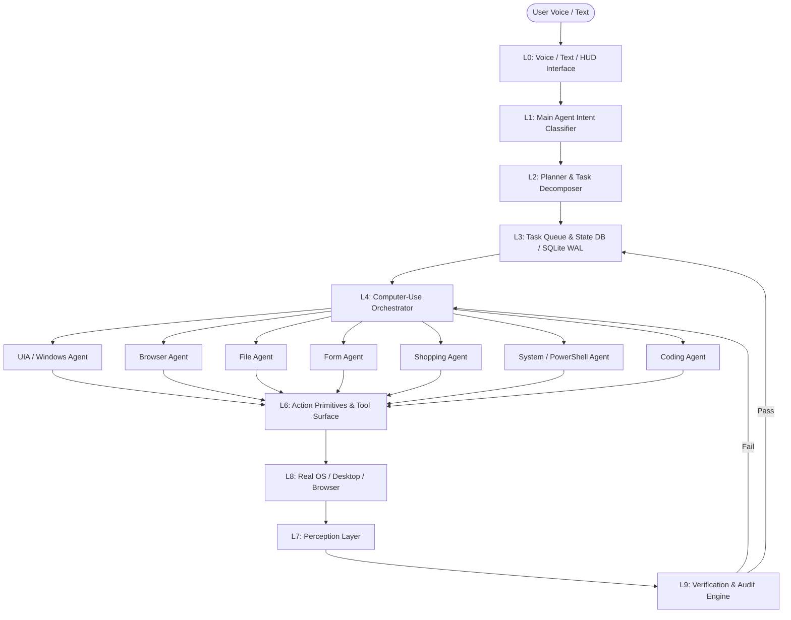

# MAX OS — Architecture & System Blueprint

| | |
|---|---|
| **Module** | MAX OS Core & Computer-Use Layer |
| **Status** | **ACTIVE & PRODUCTION READY** |
| **Companion docs** | `PRD.md`, `TRD.md`, `AGENTS.md`, `DECISIONS.md`, `API_CONTRACT.md` |

---

## 1. System Topology

MAX OS employs a hybrid architecture: the core orchestrator, memory system, and API server operate cross-platform, delegating desktop actions to specialized native platform adapters (Windows UIA/Win32 or Linux X11/AT-SPI) or a dedicated Windows execution node.



---

## 2. 10-Layer Stack Architecture

```
L0  Voice / Text / Ambient HUD Interface
L1  Main Agent — Intent understanding & Conversational Handoff
L2  Planner — DAG Task Decomposition & Step Construction
L3  Task Manager / Priority Queue & State Store (max_state.db WAL)
L4  Computer-Use Orchestrator — Enforces OTAV loop & Ultron Lockout Gates
L5  Specialized Agents (17) — Domain execution workers
L6  Action Primitives / Tool Surface (Keyboard, Mouse, Window, DOM, System)
L7  Perception Layer — 7-Level Fallback Hierarchy & ComputerState normalizer
L8  OS Integration — IUIAutomation COM, Win32 API, CDP/Playwright, X11/AT-SPI
L9  Verification & Audit — Post-action verifier, 4-attempt recovery, SQLite audit log
```

---

## 3. The Mandatory Observe→Think→Act→Verify (OTAV) Loop

Every action in every plan must execute within this closed loop:

```
        ┌─────────────┐
        │   OBSERVE   │  Capture structured ComputerState & compute ui_confidence
        └──────┬──────┘
               ▼
        ┌─────────────┐
        │    THINK    │  Match next action against Plan + Autonomy Risk Tier
        └──────┬──────┘
               ▼
        ┌─────────────┐
        │     ACT     │  Execute primitive via Perception-derived Element target
        └──────┬──────┘
               ▼
        ┌─────────────┐
        │   OBSERVE   │  Recapture ComputerState snapshot
        └──────┬──────┘
               ▼
        ┌─────────────┐
        │   VERIFY    │  Did the expected state change actually occur?
        └──────┬──────┘
          success │ failure
               │   └──────────────┐
               ▼                  ▼
          Next Step          RECOVERY CHAIN (4 Attempts)
```

---

## 4. Task State Machine

```
IDLE ──▶ OBSERVING ──▶ PLANNING ──▶ EXECUTING ──▶ VERIFYING ──▶ SUCCESS
                                        │
                                        ▼
                                      ERROR ──▶ RECOVERY ──▶ OBSERVING (replan)

ANY STATE ──▶ WAITING_FOR_USER ──▶ RESUME (back into state paused from)
```

`WAITING_FOR_USER` is reachable from any state to handle FRIDAY-tier boundary checks, Ultron-lockout confirmations, and authentication walls (CAPTCHA/MFA/OTP).

---

## 5. 7-Level Perception Fallback Hierarchy

```
LEVEL 1: Windows UI Automation (IUIAutomation / COM)
LEVEL 2: Win32 Window & Control APIs (EnumChildWindows, GetWindowRect)
LEVEL 3: Browser DOM & Accessibility Tree (Playwright / CDP)
LEVEL 4: Application-Specific Accessibility APIs
LEVEL 5: OCR (Tesseract / TextSpan detection)
LEVEL 6: Vision Model (VLM screenshot understanding)
LEVEL 7: Dynamic Coordinate Interaction (derived from bounding box, never hardcoded)
```

---

## 6. Technology Stack

| Layer | Technology |
|---|---|
| UI Automation | `pywinauto`, `comtypes` (IUIAutomation), Win32 API (`pywin32`) |
| Browser Control | Chromium DevTools Protocol / Playwright |
| OCR | Tesseract / Computer Vision OCR |
| Vision Fallback | Anthropic / Gemini Vision LLM APIs |
| State Database | SQLite 3 (`max_state.db`, WAL Mode, 24 tables) |
| Server / API | FastAPI, Uvicorn over loopback/LAN |
| Audio & Voice | FasterWhisper STT, ElevenLabs / Piper TTS, WebRTC VAD |
| Frontend HUD | HTML5 / JavaScript Real-Time Desktop Stream (`ui/live_desktop/`, `jarvis_hud_live.html`) |
