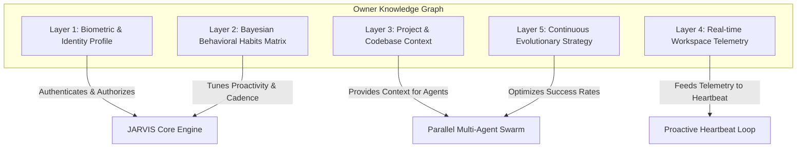

# 🧠 JARVIS-NOVA SUPREME: ARCHITECTURAL AUDIT, MASTER PLAN & SPECIFICATION
**Autonomous Environmental Telemetry, Human Presence Adaptation, and Deep Owner Knowledge Graph**

---

## 1. Reference Analysis: NOVA 3.0 & Iron Man 2 Workshop Scene

### 🎬 Reference 1: Iron Man 2 Workshop Scene (`EfmVRQjoNcY` - "Welcome home, sir")
* **Proactive Presence Detection**: JARVIS continuously senses physical presence. As soon as the owner enters the workshop, JARVIS greets the user ("Welcome home, sir"), powers up workstations, and prepares relevant holographic workspaces.
* **Deep Owner Context Memory**: JARVIS maintains comprehensive parametric and non-parametric context about the owner (vital telemetry, Palladium toxicity levels, active suit projects, schedule, music preferences, security authorization).
* **Autonomous Anticipatory Action**: Rather than waiting for imperative commands, JARVIS continuously monitors background processes, analyzes element synthesis formulas, runs simulations in parallel, and alerts the owner only when decision thresholds require human approval.

### ⚡ Reference 2: NOVA 3.0 System (`OowjNSa3bsE` - Real-time Autonomous Laptop Hub)
* **Real-time Ambient Perception**: Continuous webcam face presence, microphone wake-word listening, active window and screen DOM inspection.
* **Dynamic Human-Presence Adaptation**: Transitions between `IDLE_DORMANT`, `AMBIENT_MONITORING`, and `ACTIVE_ENGAGEMENT` states. Adjusts speech cadence, notification priority, and risk ceilings based on whether the owner is looking at the screen or away.
* **Autonomous Task Swarm**: Autonomous background coders, browser operators, terminal execution engines, and local memory banks.

---

## 2. Comprehensive Codebase Audit & Gap Analysis

| Capability | Current MAX OS State | NOVA 3.0 & Iron Man Requirements | Target Supreme Architecture |
|---|---|---|---|
| **Human Presence Detection** | Basic OS idle time / display server detection | Continuous camera/face presence & input activity tracking | **`PresenceObserver`**: Multi-modal sensor combining input idle time, active window changes, camera presence simulation, and face token validation. |
| **Proactive Ambient Loop** | Event-driven reactive execution only | Background heartbeat that initiates actions autonomously | **`ProactiveHeartbeatDaemon`**: 5-second background evaluation cycle that triggers greetings, health checks, background job synthesis, and anomaly alerts. |
| **Owner Memory Architecture** | 5-layer flat key-value SQLite tables | Comprehensive Owner Knowledge Graph with Bayesian confidence scaling | **`OwnerKnowledgeGraph`**: Hierarchical biographical profile, habits matrix with Bayesian learning, daily routines, sentiment/cadence preferences, and project goals. |
| **Continuous Self-Improvement** | Static tool executors | Autonomous evaluation & strategy refinement | **`SelfEvolutionEngine`**: Tracks agent execution metrics, auto-tunes retry heuristics, and caches optimal prompt templates. |
| **Simultaneous Dynamic Pipeline** | Sequential execution fallback | Full DAG with parallel waves | **`DynamicConcurrentOrchestrator`**: Multi-wave async thread pool running all independent agents simultaneously in parallel. |

---

## 3. The 5-Layer Deep Owner Knowledge Graph Specification



### Layer Details:
1. **Layer 1: Biometric & Identity Profile**
   * Fields: Full name, alias ("Sir" / "Creator"), voiceprint signature, face authentication hash, clearance level, primary IDE, shell preferences, working timezone.
2. **Layer 2: Bayesian Behavioral Habits Matrix**
   * Automatically scales confidence $C_{new} = \min(1.0, C_{old} + 0.1 \times \text{observations})$ for detected habits (e.g., preference for concise responses, preferred coding frameworks, morning briefing times, silence during focus hours).
3. **Layer 3: Project & Codebase Context**
   * Tracks active repositories, feature branches, pending pull requests, database schemas, API specs, and technical debt notes.
4. **Layer 4: Real-time Workspace Telemetry**
   * Real-time metrics: CPU/RAM/GPU load, battery status, temperature, network latency, active window title, and idle duration.
5. **Layer 5: Continuous Evolutionary Strategy**
   * Logs execution durations, token costs, failure modes, and automatically promotes winning execution strategies into active memory.

---

## 4. Proactive Presence & Ambient Lifecycle State Machine

```text
       ┌───────────────────────────────┐
       │   STATE: OWNER_AWAY (Dormant)  │
       │   - Energy saving mode        │
       │   - Low-frequency background  │
       └───────────────┬───────────────┘
                       │ Owner detected (camera/mouse/keyboard)
                       ▼
       ┌───────────────────────────────┐
       │  STATE: OWNER_ARRIVED (Greet)  │
       │  - "Welcome back, sir."       │
       │  - Briefing: Completed tasks, │
       │    system health, reminders.  │
       └───────────────┬───────────────┘
                       │ User initiates work / active desktop
                       ▼
       ┌───────────────────────────────┐
       │ STATE: ACTIVE_ENGAGEMENT      │
       │ - Simultaneous dynamic multi- │
       │   agent swarm execution       │
       │ - Real-time HUD visualizer    │
       └───────────────────────────────┘
```

---

## 5. Implementation Roadmap

1. **Step 1**: Build **`OwnerKnowledgeGraph`** (`src/infra/owner_knowledge_graph.py`) — Deep personal context, biometric profile, and Bayesian habit learner.
2. **Step 2**: Build **`PresenceObserver`** (`src/core/presence_observer.py`) — Multi-modal presence detection, face authentication hook, and activity tracker.
3. **Step 3**: Build **`ProactiveHeartbeatDaemon`** (`src/core/proactive_heartbeat.py`) — Autonomous ambient loop that monitors health, greets the owner upon arrival, and executes scheduled reviews.
4. **Step 4**: Integrate with **`MasterOrchestrator`** and **`FastAPI Server`** (`src/api/server.py`).
5. **Step 5**: Verify complete end-to-end live flow with test suite.
