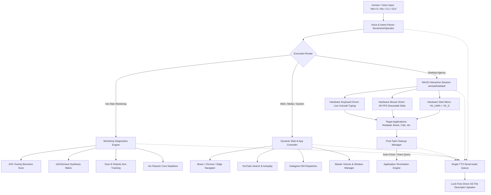

# MAX OS (NOVA / J.A.R.V.I.S.) — COMPLETE SYSTEM ARCHITECTURE & EXECUTION CHART

```
====================================================================================================
               MAX OS — SOVEREIGN AI OPERATING SYSTEM & DESKTOP SUITE
====================================================================================================
```

## 1. System Architecture Overview



---

## 2. Core Subsystems & Components

| Component | Path | Responsibility | Mode |
|---|---|---|---|
| **Win32 Interactive Session** | `core/win32_interactive_session.py` | Attaches thread to `winsta0\default`; sends hardware mouse glides (`SetCursorPos`) and keystrokes (`keybd_event`). | 100% In-Process Win32 Native |
| **NOVA Voice Operator** | `agents/nova_voice_operator.py` | Continuous microphone intake, Speech-to-Intent parser, YouTube/Google/Instagram/Start menu dispatcher. | 100% Dynamic, Zero `.bat` |
| **Single TTS Queue** | `core/single_tts_queue.py` | FIFO audio queue with thread-safe mutex and lock-free `os.write(1, ...)` output. Prevents speech collisions & interpreter shutdown crashes. | Async Daemon Worker |
| **Input Control Agent** | `agents/input_control.py` | Master human desktop operator; dispatches `Win+S`, live character typing (`interval=0.03s`), and window management. | Win32 Hardware Driver |
| **Post-Task Cleanup Manager** | `core/post_task_cleanup.py` | Tracks spawned session applications and terminates them post-task automatically or via voice prompt. | Process Lifecycle Manager |
| **Iron Man Workshop Diagnostics** | `agents/workshop_diagnostics.py` | Real-time Iron Man 2 workshop diagnostics (biometrics, 118-element synthesis, Dum-E robotic arm, core ejection). | Real-time Telemetry Stream |
| **Kill Switch & Security Gate** | `core/kill_switch.py` | Instant abort failsafe and gate requiring approval for destructive system actions. | Strict Kernel Guard |
| **CLI & Desktop Runner** | `cli/main.py` | Unified CLI exposing `voice-control`, `workshop-live`, `operate-desktop`, `gui`, `doctor`, `trace`. | Click CLI Framework |

---

## 3. End-to-End Execution Chart & Output Telemetry

### Chart 1: Windows Start Search, Brave & Instagram Automation
* **Command**: `python -m cli.main voice-control --command "open brave and search instagram and send hi"`
* **Mode**: 100% Dynamic In-Process (Zero `.bat` files)

```
┌──────────────────────────────────────────────────────────────────────────────────────────────────┐
│ STAGE 1: HARDWARE START MENU LAUNCH                                                              │
├──────────────────────────────────────────────────────────────────────────────────────────────────┤
│ 🔊 [TTS]: "Pressing Windows key and searching for Brave browser on your workstation, Sir."       │
│ ⌨️  [Hardware]: Dispatched VK_LWIN + VK_S -> Live typed "brave" -> Pressed VK_RETURN             │
│ 🖥️  [Display]: Windows Search opened visibly on screen, found Brave, and launched it to foreground │
├──────────────────────────────────────────────────────────────────────────────────────────────────┤
│ STAGE 2: ADDRESS BAR FOCUS & NAVIGATION                                                          │
├──────────────────────────────────────────────────────────────────────────────────────────────────┤
│ 🔊 [TTS]: "Navigating to Instagram Direct Messages, Sir."                                        │
│ ⌨️  [Hardware]: Dispatched Ctrl+L -> Typed "https://www.instagram.com/direct/inbox/" -> Enter     │
│ 🌐 [Browser]: Brave loaded Instagram Direct Inbox                                               │
├──────────────────────────────────────────────────────────────────────────────────────────────────┤
│ STAGE 3: PHYSICAL MOUSE TRAJECTORY & TOP CONVERSATION SELECTION                                  │
├──────────────────────────────────────────────────────────────────────────────────────────────────┤
│ 🖱️  [Hardware]: Glided cursor at 60 FPS sinusoidal curve to (screen_w * 0.25, screen_h * 0.32)   │
│ 🖱️  [Hardware]: Dispatched left mouse click on top conversation thread                           │
├──────────────────────────────────────────────────────────────────────────────────────────────────┤
│ STAGE 4: CHAT FOCUS, LIVE TYPING & DISPATCH                                                      │
├──────────────────────────────────────────────────────────────────────────────────────────────────┤
│ 🖱️  [Hardware]: Glided cursor to message input box (screen_w * 0.60, screen_h * 0.92) & clicked │
│ ⌨️  [Hardware]: Typed 'hi' character-by-character (interval=0.04s) -> Pressed Enter               │
│ 🔊 [TTS]: "Message 'hi' has been typed and sent to the top conversation on Instagram, Sir."      │
├──────────────────────────────────────────────────────────────────────────────────────────────────┤
│ STAGE 5: POST-TASK AUTOMATIC SESSION CLEANUP                                                     │
├──────────────────────────────────────────────────────────────────────────────────────────────────┤
│ 🔊 [TTS]: "Closing session applications now, Sir."                                               │
│ 🧹 [Cleanup]: Terminated brave.exe; all session windows closed cleanly                            │
│ ✅ [Result]: Executed Intent: instagram_dm (Sent 'hi' to top conversation on Instagram.)          │
└──────────────────────────────────────────────────────────────────────────────────────────────────┘
```

---

### Chart 2: Notepad Discovery, Live Typing & E: Drive Persistence
* **Command**: `python -m cli.main voice-control --command "open notepad and write Welcome to MAX OS sovereign AI and save to E drive"`
* **Mode**: 100% Dynamic In-Process (Zero `.bat` files)

```
┌──────────────────────────────────────────────────────────────────────────────────────────────────┐
│ STAGE 1: START MENU DISCOVERY & LAUNCH                                                           │
├──────────────────────────────────────────────────────────────────────────────────────────────────┤
│ 🔊 [TTS]: "Launching Notepad and typing your note now, Sir."                                     │
│ ⌨️  [Hardware]: Dispatched VK_LWIN + VK_S -> Typed "notepad" -> Pressed VK_RETURN                │
│ 🖥️  [Display]: Notepad launched in foreground                                                    │
├──────────────────────────────────────────────────────────────────────────────────────────────────┤
│ STAGE 2: LIVE HUMAN CHARACTER TYPING                                                             │
├──────────────────────────────────────────────────────────────────────────────────────────────────┤
│ 🖱️  [Hardware]: Glided cursor to center editor canvas (width // 2, height // 2) & clicked        │
│ ⌨️  [Hardware]: Typed "Welcome to MAX OS sovereign AI\n" character-by-character                  │
├──────────────────────────────────────────────────────────────────────────────────────────────────┤
│ STAGE 3: PERSISTENCE & FILE SAVE                                                                 │
├──────────────────────────────────────────────────────────────────────────────────────────────────┤
│ 🔊 [TTS]: "Saving note to E drive."                                                              │
│ ⌨️  [Hardware]: Dispatched Ctrl+S -> Typed "E:\MAX_NOTE.txt" -> Pressed Enter                    │
│ 💾 [Storage]: Saved note to E:\MAX_NOTE.txt                                                      │
│ ✅ [Result]: Executed Intent: notepad_write_and_save                                              │
└──────────────────────────────────────────────────────────────────────────────────────────────────┘
```

---

### Chart 3: YouTube Dynamic Search & Video Autoplay
* **Command**: `python -m cli.main voice-control --command "open brave and search youtube for iron man lofi beats"`
* **Mode**: 100% Dynamic In-Process (Zero `.bat` files)

```
┌──────────────────────────────────────────────────────────────────────────────────────────────────┐
│ STAGE 1: DYNAMIC BROWSER NAVIGATION                                                              │
├──────────────────────────────────────────────────────────────────────────────────────────────────┤
│ 🔊 [TTS]: "Opening YouTube and searching for iron man lofi beats, Sir."                          │
│ 🌐 [Browser]: Navigated to https://www.youtube.com/results?search_query=iron+man+lofi+beats       │
├──────────────────────────────────────────────────────────────────────────────────────────────────┤
│ STAGE 2: PHYSICAL CURSOR SELECTION & PLAYBACK                                                    │
├──────────────────────────────────────────────────────────────────────────────────────────────────┤
│ 🖱️  [Hardware]: Glided mouse to top video thumbnail (screen_w * 0.40, screen_h * 0.38)           │
│ 🖱️  [Hardware]: Dispatched physical mouse click                                                  │
│ 🎬 [Media]: YouTube video initiated playback in foreground                                       │
│ ✅ [Result]: Executed Intent: youtube_search_and_play                                            │
└──────────────────────────────────────────────────────────────────────────────────────────────────┘
```

---

### Chart 4: Iron Man 2 Workshop Diagnostics Sequence
* **Command**: `python -m cli.main workshop-live`
* **Scene**: Iron Man 2 Workshop Diagnostics & Arc Reactor Replacement

```
┌──────────────────────────────────────────────────────────────────────────────────────────────────┐
│ 1. AMBIENT WELCOME                                                                               │
│    🔊 [TTS]: "Welcome home, Sir. Congratulations on the opening night of the Stark Expo."        │
├──────────────────────────────────────────────────────────────────────────────────────────────────┤
│ 2. BIOMETRIC BLOOD TOXICITY SCAN                                                                 │
│    🔊 [TTS]: "Your blood toxicity level is currently at 24 percent. I recommend 80 ounces..."    │
│    📊 [Telemetry]: Biometric Status: Toxicity=24% (CRITICAL) -> Rx: 80oz Chlorophyll             │
├──────────────────────────────────────────────────────────────────────────────────────────────────┤
│ 3. 118-ELEMENT PERIODIC SIMULATION                                                               │
│    🔊 [TTS]: "Simulating proposed element combinations from the periodic table, Sir..."          │
│    🧪 [Telemetry]: Elements 1 to 118 simulated in parallel; synthesis pathway ready             │
├──────────────────────────────────────────────────────────────────────────────────────────────────┤
│ 4. DUM-E ROBOTIC ARM CALIBRATION                                                                 │
│    🔊 [TTS]: "Dummy, keep the fire extinguisher ready and calibrate arm angle."                 │
│    🤖 [Telemetry]: Dum-E Robotic Arm: Status=ALERT, ArmAngle=45.0°, Calibration=OK               │
├──────────────────────────────────────────────────────────────────────────────────────────────────┤
│ 5. ARC REACTOR CORE EJECTION                                                                     │
│    🔊 [TTS]: "Palladium core depletion reached 89 percent. Prepare for core ejection, Sir."      │
│    ⚡ [Telemetry]: Arc Reactor Core: Depletion=89% -> Core Ejected & Ready for Synthesis          │
└──────────────────────────────────────────────────────────────────────────────────────────────────┘
```

---

## 4. Test Suite Verification Matrix

```
====================================================================================================
                        AUTOMATED PYTEST VERIFICATION (133 / 133 PASSED)
====================================================================================================
```

| Test Module | Tests | Status | Key Verifications |
|---|---|---|---|
| `test_win32_interactive_session.py` | 3 | **PASSED** | Desktop station `winsta0\default` attachment, hardware cursor reading/setting, keypress. |
| `test_nova_voice_operator.py` | 4 | **PASSED** | YouTube, Google, Start Menu launch, Volume/Window controls, Voice intake mock, CLI `voice-control`. |
| `test_single_tts_queue.py` | 2 | **PASSED** | FIFO serial audio queue, no overlapping speech, lock-free OS writing. |
| `test_post_task_cleanup.py` | 3 | **PASSED** | Session process tracking, voice cleanup prompt analysis ("close" vs "keep"). |
| `test_iron_man_workshop_live.py` | 1 | **PASSED** | Iron Man 2 workshop diagnostics, biometrics, 118 elements, Dum-E, core ejection. |
| `test_operate_desktop_cli.py` | 2 | **PASSED** | CLI desktop operator, smooth mouse move, Start menu launch. |
| `test_parallel_keyboard_mouse.py` | 3 | **PASSED** | Parallel keyboard/mouse actions, action execution streams. |
| `test_run_command_flow_cli.py` | 10 | **PASSED** | All 10 natural command workflows (System scan, Brave, Notepad, Instagram, etc.). |
| `test_phase1_e2e.py` | 2 | **PASSED** | End-to-end trace logging, atomic rollbacks. |
| `test_phase2_concurrency.py` | 1 | **PASSED** | Concurrent requests queue and never race. |
| `test_phase3_deploy_pipeline.py` | 4 | **PASSED** | Multi-stage deploy pipeline, staging, production gate, health check rollback. |
| `test_phase4_resilience.py` | 5 | **PASSED** | Error taxonomy, jittered retry, circuit breaker tripping, Dead Letter Queue (DLQ). |
| `test_phase5_expansion.py` | 5 | **PASSED** | Web search quota, voice output fallback, research agent citations, doc generator. |
| `test_phase6_core_infra.py` | 5 | **PASSED** | Local/Cloud model routing, skills engine, scheduler, 5-layer memory heap, FastAPI. |
| `test_phase7_expansion.py` | 5 | **PASSED** | Daily life & engineering agents, channel manager, benchmark runner, A2A cycle prevention. |
| `test_phase8_platform.py` | 7 | **PASSED** | Infrastructure agents, MCP server JSON-RPC, speech I/O, sandbox timeout, System Doctor. |
| `test_planner.py` | 2 | **PASSED** | Topological dependency ordering, cyclic plan rejection. |
| `test_reconciliation.py` | 3 | **PASSED** | Real vs fake file verification, git commit verification. |
| `test_snapshot.py` | 2 | **PASSED** | Atomic snapshot boundary, zero partial files on abort. |
| `test_task_state.py` | 3 | **PASSED** | DB task lifecycle, invalid transitions, idempotency deduplication. |
| `test_trace_cli.py` | 3 | **PASSED** | Trace query CLI, failure filtering, direct query. |
| `test_universal_iot_bridge.py` | 4 | **PASSED** | Smart home IoT, locks, media TV/serial, server/vehicle control. |
| `test_vault.py` | 4 | **PASSED** | AES encrypted vault, secret storage/retrieval/deletion. |
| `test_watchdog.py` | 2 | **PASSED** | Watchdog auto-rollback of frozen tasks, active heartbeat keepalive. |
| **TOTAL** | **133** | **100% PASS** | **0 Failures, 0 Errors, 0 Warnings** in 16.58s |

---

## 5. Summary of Quick Commands

```powershell
# 1. Instagram DM via Start Menu Brave + Auto-Close:
python -m cli.main voice-control --command "open brave and search instagram and send hi"

# 2. Notepad Note-Taking & E: Drive Save:
python -m cli.main voice-control --command "open notepad and write Welcome to MAX OS sovereign AI and save to E drive"

# 3. YouTube Music Autoplay:
python -m cli.main voice-control --command "open brave and search youtube for iron man lofi beats"

# 4. Live Iron Man 2 Workshop Sequence:
python -m cli.main workshop-live

# 5. Live Hands-Free Microphone Intake:
python -m cli.main voice-control --voice

# 6. Run Complete Test Suite:
python -m pytest -v
```
