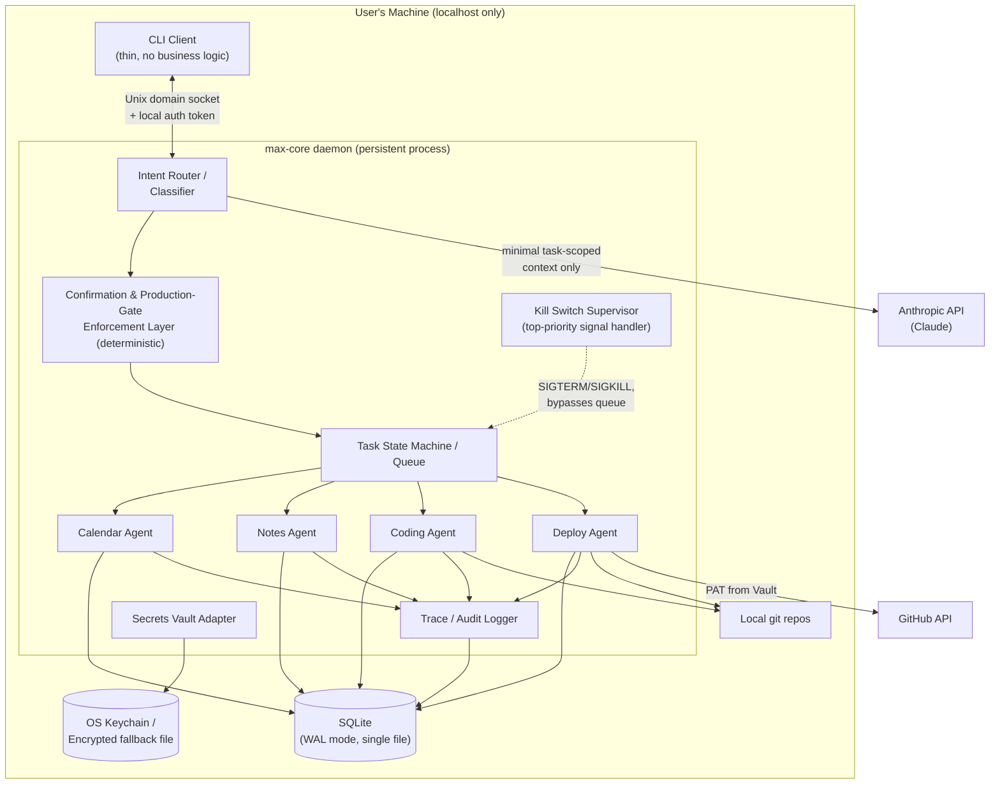
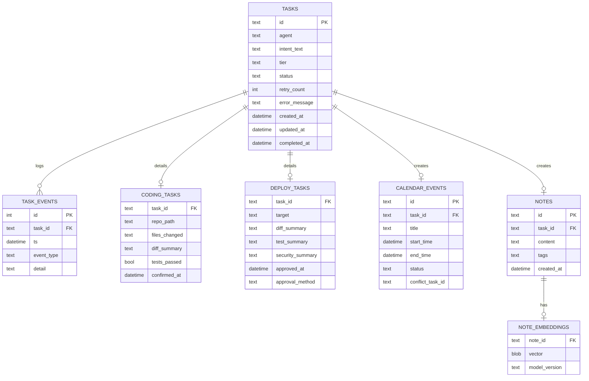

# MAX OS — Technical Requirement Document (TRD)
### v1 scope only — derived from PRD.md. Companion doc: ARCHITECTURE.md (33-agent roadmap)

**Author:** Backend Architecture Review
**Date:** August 12, 2026
**Status:** Draft for implementation planning

---

## 0. Design Principles

Every decision below is filtered through two constraints the PRD implies but doesn't state outright:

1. **This is a single-user, single-machine system, permanently.** v1 isn't a scaled-down version of a future multi-tenant product — the PRD explicitly rules that out (§2, §7). Designing as if multi-tenancy is coming later would be premature abstraction, not foresight.
2. **Correctness and recoverability matter more than throughput.** The success metric that matters most (§6 of the PRD: "2+ weeks without a manual DB fix or restart") is a *reliability* bar, not a *performance* bar. Every architectural choice here optimizes for "boring and resumable" over "fast and clever."

Concretely, this TRD deliberately does **not** include: a database server (Postgres/MySQL), a message broker (Redis/Celery/Kafka), a container orchestrator, a public-facing API, OAuth/SSO, a vector database, or a microservices split. All of those solve problems MAX OS v1 doesn't have. Where a future phase (per ARCHITECTURE.md) might need one, this doc notes it as a seam, not a build item.

---

## 1. System Architecture Overview

MAX OS v1 is a **modular monolith**: one long-running local daemon process, talked to by a thin CLI client, backed by a single embedded database file. Nothing in v1 listens on a non-loopback interface.

**Why a daemon instead of a script invoked per-command:** the PRD requires MAX to "finish correctly or tell the user clearly why it didn't" for multi-step tasks (§3), and requires reminders and deploys to actually fire on schedule (§4). A process that only exists while the CLI is open can't do either. The daemon owns task lifecycle; the CLI is disposable.

**Why one process, not four agent processes:** four agents at v1 scale (single user, bursty usage) don't generate enough concurrent load to justify process isolation's overhead (IPC, separate crash domains, separate deploy artifacts). Each agent is a Python/Node module behind a shared `Agent` interface (`classify()`, `tier_for(intent)`, `execute(task)`, `report()`), invoked in-process by the queue. This also directly enables the Phase 5+ growth to 33 agents: new agents implement the same interface and register with the router — no core rework.

---

## 2. Frontend Responsibilities (CLI + Trace Log)

Per PRD §7, v1 has no dashboard — the "frontend" is a CLI and a human-readable trace log. Keep it genuinely thin:

- **Natural-language input capture** — pass raw text to the daemon; no local intent parsing, no local business rules.
- **Trace log rendering** — poll or stream `GET /v1/trace` and render task lifecycle events (queued → running → awaiting confirmation → completed/failed) in real time, in plain language.
- **Confirmation & production-gate prompts** — render the diff/test/security summary the backend returns; collect the user's explicit response and forward it verbatim. The CLI does not decide whether a gate applies or interpret "yes, deploy it now, I already told you" as approval — it only relays what the user types into the specific approval action (see §6, §7).
- **Kill switch trigger** — a dedicated command (`max kill`) and a bound interrupt (e.g., double `Ctrl+C`) that calls `POST /v1/kill` directly, outside the normal request queue, so it can't get stuck behind a hung task.
- **No local state beyond the current session's display buffer.** If the CLI crashes or closes, the daemon and its task state are unaffected — reopening the CLI just resumes showing the trace log.

Keeping all logic server-side means the future Phase 5+ dashboard (explicitly deferred, not v1) can be a second thin client against the exact same API without duplicating any decision logic.

---

## 3. Backend Responsibilities

The `max-core` daemon owns everything that matters for correctness:

| Component | Responsibility |
|---|---|
| **Intent Router** | Classifies free text into `{agent, intent, confidence}` via an LLM call scoped to *only* the text needed for classification — never the full note/calendar/code database (data boundary, PRD §5). Low-confidence classifications ask a clarifying question instead of guessing (PRD §8 — threshold stays configurable/tunable, not hardcoded, pending real usage data). |
| **Confirmation & Gate Enforcement Layer** | Deterministic, non-LLM code that decides which tier (`auto` / `confirm` / `production_gate`) a task requires, based on **task metadata**, not on how the request was phrased. See §7. |
| **Task State Machine / Queue** | In-process async queue (see §9) backed by the SQLite `tasks` table so state survives a daemon restart. |
| **Four Agent Modules** | Calendar, Notes, Coding, Deploy — each implements the shared `Agent` interface and owns its own domain logic and external calls. |
| **Kill Switch Supervisor** | A signal handler registered before anything else starts, with a hard 1-second budget: on trigger, it (1) sends SIGTERM then SIGKILL to any subprocess a task spawned (test runners, git, deploy scripts), (2) marks all in-flight tasks `killed` in the DB, (3) only then allows the daemon to exit or idle. This runs outside the normal queue so a hung task can't block it. |
| **Trace / Audit Logger** | Every state transition, every LLM call's *metadata* (not full payloads, to avoid logging secrets), every confirmation, every gate decision — written to `task_events`, append-only. |
| **Secrets Vault Adapter** | Single interface (`get_secret(name)`) backed by OS keychain first, encrypted-file fallback second. No component reads `.env` files or hardcoded tokens directly. |
| **External Integration Adapters** | Thin wrappers around the LLM API, GitHub API, local embedding model, and shelled-out test/security tools — isolated so any one of them can be swapped without touching agent logic. |

---

## 4. Database Schema Proposal

**Engine: SQLite, WAL mode, single file, indexed.** This is a single-user system with modest write volume (a few hundred tasks/notes a day at most) — Postgres/MySQL would add an operational dependency (a server to keep running, back up, and recover) for no real benefit. WAL mode gives crash-safe writes and lets the trace log stream while a task writes, which is the main concurrency need here.

Two tables worth calling out specifically because they map directly to PRD non-functional requirements:

- **`task_events`** is append-only and is *the* mechanism satisfying "no task fails silently" (PRD §5) — every retry, escalation, and explicit report is a row here, queryable after the fact, not just a log line that scrolls away.
- **`deploy_tasks.approval_method`** records *how* production approval was given (e.g. `interactive_tty_confirm`, never `chat_message`) — this is what makes the gate-bypass metric (PRD §6) auditable rather than just asserted.

No separate vector database for Notes: at personal-notes scale (thousands, not millions, of rows), brute-force cosine similarity over embeddings stored as BLOBs in SQLite, done in the app layer, is fast enough and removes an entire dependency. Revisit only if Notes' Phase 5+ scope grows to something like full-document indexing.

---

## 5. API Structure

Even though nothing here is public-facing, a small versioned internal API (over a **Unix domain socket**, not a TCP port) keeps the CLI-to-daemon contract stable as agents get added in later phases, without needing a full REST framework or OpenAPI tooling.

| Method & Path | Purpose | Tier-relevant? |
|---|---|---|
| `POST /v1/tasks` | Submit a new natural-language request | Router decides tier |
| `GET /v1/tasks/{id}` | Poll task status | — |
| `POST /v1/tasks/{id}/confirm` | Respond to a `confirm`-tier prompt | Yes — confirm tier |
| `POST /v1/tasks/{id}/approve` | Respond to a `production_gate` prompt — **only** reachable via the interactive approval flow, never the same code path as `/confirm` | Yes — gate tier |
| `POST /v1/kill` | Immediate kill-switch trigger, highest priority, processed outside the queue | — |
| `GET /v1/trace?since=` | Stream/poll trace log events | — |
| `POST /v1/notes` | Store a note | auto |
| `GET /v1/notes/search?q=` | Semantic retrieval | auto |
| `POST /v1/calendar/events` | Schedule/remind | auto (unless conflict) |
| `GET /v1/calendar/conflicts` | Check pending conflicts | — |

Design notes:

- **Unix domain socket over HTTP-on-loopback**: file-permission-based access control comes for free (only the owning OS user can even open the socket), so there's no need to invent an auth scheme to stop other local users. §7 covers the additional token layer used anyway, mainly to stop *other processes running as the same user* from issuing commands unintentionally.
- **`/approve` is a distinct endpoint from `/confirm`**, not a parameter on the same one. This is intentional redundancy: it means the gate-integrity requirement (PRD §5) is enforced by the API surface itself, not by a conditional inside shared code that a future refactor could quietly weaken.
- Versioned (`/v1/...`) even internally, so Phase 5's dashboard or additional agents can add `/v2` behavior without breaking the CLI.

---

## 6. Authentication Strategy

There is no end-user login in v1 — there is exactly one user, and the PRD explicitly excludes remote/multi-user access (§7). "Authentication" here means three narrower things:

1. **CLI ↔ daemon:** the Unix socket already restricts connections to the owning OS user. On top of that, a per-install token (generated on first run, stored at `~/.config/max-os/token` with `0600` permissions) must accompany every request, so that another local process running as the same user can't silently drive MAX without going through the intended client. This is deliberately lightweight — no JWT, no session expiry logic, no refresh tokens. There's nothing to expire; if the token is compromised, the fix is "regenerate it," not "build a rotation system."

2. **Production-gate approval — the one place auth actually matters:** PRD §5 requires the gate to be unbypassable "regardless of how urgently or persistently" a request is phrased. The architectural answer is that **the LLM is never the authority that decides or grants gate approval.** Concretely:
   - Whether a task is `production_gate`-tier is decided by matching the task's *resolved deploy target* against a config-defined allowlist (`config/production_targets.yaml`), checked in plain code before the LLM is even involved in execution — not inferred from what the user said.
   - Approval requires the CLI's `/approve` action, which is only satisfiable through an **interactive TTY prompt** requiring a typed confirmation (not a flag that can be scripted, not a message the LLM relays on the user's behalf, not something achievable through the same chat turn that requested the deploy). The `approval_method` field is recorded specifically so this is auditable, not just designed-in.
   - This means "urgently phrase it as an emergency" simply has no code path to reach approval faster — the gate isn't a prompt the LLM is asked to respect, it's a wall the LLM's output can't reach past.

3. **External services** (GitHub, Anthropic API): standard credential handling, not custom auth logic —
   - GitHub: a fine-grained Personal Access Token scoped to *repo contents + pull requests only* (no admin, no org scope), stored via the Secrets Vault Adapter.
   - Anthropic API key: same vault, loaded at process start, never written to logs or the trace table (trace events log *that* an LLM call happened and its purpose, not the key or full payload).
   - Vault backing: OS keychain first (`libsecret`/Secret Service on Linux), falling back to an AES-256-encrypted local file with a key derived from an OS-keyring-stored passphrase if no keychain is available. Zero plaintext secrets anywhere, satisfying PRD §5 directly.

---

## 7. Third-Party Dependencies

Kept intentionally short — every addition here is a thing that can break, need updating, or leak data.

| Dependency | Role | Why this one / not something heavier |
|---|---|---|
| **Anthropic API (Claude)** | Intent classification, coding assistance, deploy diff/security summarization | Already the LLM in your existing workflow; no separate provider to manage. Calls are scoped per-task, never full-DB dumps, per the data-boundary requirement. |
| **Local embedding model** (e.g. a small CPU-friendly sentence-embedding model) | Notes semantic search | Runs entirely on-device, so note content never leaves the machine for retrieval — the strongest possible reading of the data-boundary requirement. Deliberately *not* a GPU-heavy model: your RTX 3050's 4GB VRAM is better reserved for the coding/image-gen work you already run locally, and a small CPU model is more than sufficient at personal-notes volume. |
| **GitHub REST API** | Deploy Agent repo-push mode | Native, well-documented, minimal-scope PATs available. No self-hosted Git server needed for v1. |
| **Project's own test runner** (pytest/jest/whatever the target repo uses) | Coding Agent's "tested code" requirement | Shell out to the existing suite rather than reimplementing test execution — MAX shouldn't own test frameworks. |
| **A mature secret scanner** (e.g. gitleaks or detect-secrets) | Pre-push secrets audit, production-gate security summary | Reuses a maintained tool instead of hand-rolled regex secret detection, which is exactly the kind of thing worth not building yourself. |
| **A dependency vulnerability scanner** (e.g. `pip-audit`/`npm audit`, matched to the target repo's ecosystem) | Production-gate security summary | Same rationale — off-the-shelf, low-maintenance. |
| **SQLite** (bundled, no server) | All persistence | No install, no server process, single-file backups. |
| **systemd (user service)**, since the target machine runs Linux | Keeps `max-core` alive across reboots/crashes, gives a clean OS-level mechanism to complement the in-process kill switch | Avoids hand-rolling a process supervisor. |

Explicitly **not** included in v1: Redis, Celery/Kafka, Postgres/Elasticsearch, Docker/Kubernetes, any OAuth provider, any vector database. If a later phase's workload genuinely outgrows SQLite or the in-process queue, that's a deliberate, data-driven upgrade — not a default.

---

## 8. Scalability Considerations

"Scalability" for MAX OS v1 doesn't mean handling more users or more traffic — the PRD rules that out by design (§2, §7). It means three narrower things:

**Data growth over time.** A single user's tasks/notes/events accumulate for years, not scale horizontally in a given moment. SQLite comfortably handles this into the tens-of-GB range with proper indices (on `tasks.status`, `tasks.created_at`, `task_events.task_id`) and periodic `VACUUM`. No migration to a heavier DB is anticipated for v1's realistic lifetime.

**Concurrent tasks, not concurrent users.** A single user can still plausibly have a coding task running while a reminder fires. This is handled with an in-process async task queue (Python `asyncio` or Node's event loop, depending on implementation language) with a small worker pool (e.g. 2–4 concurrent task slots), backed by the `tasks` table so state is never only-in-memory. This avoids the operational cost of an external broker while still giving real concurrency for the actual usage pattern.

**Crash recovery, which is the metric that actually matters here.** The PRD's headline success metric is 2+ weeks without needing a manual DB fix or restart to recover from a stuck state (§6). The design implications:
- SQLite in WAL mode for crash-safe writes.
- On daemon startup, any task left `running` from before a crash is **not** blindly resumed — for Coding/Deploy agents especially, blindly re-running a task that may have partially completed (e.g., already opened a PR) risks duplicate side effects. Instead, interrupted tasks are marked `interrupted — needs review` and surfaced in the trace log, and only `auto`-tier, side-effect-free tasks (e.g., a note write that's naturally idempotent) are safe to auto-resume.
- Retries (PRD §6's "at least one real retry/escalation instance") are tracked via `tasks.retry_count` with a capped backoff, and every retry is a `task_events` row — so the "no task fails silently" requirement and the "prove retry/escalation actually fired" metric are the same underlying data, not two separate systems to build.

**Forward compatibility for the 33-agent roadmap**, without building for it now: the shared `Agent` interface (§1, §3) is the only piece of "scaling for the future" this TRD recommends doing early, because it's cheap now and expensive to retrofit later. Everything else — the queue, the DB, the API — stays exactly as sized for four agents and one user, and gets revisited if and when Phase 5 data says it needs to.

---

## 9. Non-Functional Requirements Traceability

Mapping PRD §5 directly to where it's enforced, so this is checkable rather than just asserted:

| PRD Requirement | Enforced by |
|---|---|
| No file/calendar/note content leaves the machine beyond task-specific need | Local embedding model for Notes; per-task-scoped LLM payloads in the Router; documented in §3, §7 |
| Zero plaintext secrets | Secrets Vault Adapter (keychain-first), `secrets_audit` checks pre-push, no component reads raw `.env` — §6, §7 |
| Kill switch ≤1s | Dedicated signal handler registered at startup, bypasses the task queue entirely, SIGTERM→SIGKILL escalation — §3 |
| Gate integrity (no phrasing bypass) | `production_gate` tier decided by deterministic config match, not LLM inference; `/approve` reachable only via interactive TTY confirm; distinct from `/confirm` — §6, §5 |
| No silent failures | `task_events` append-only audit trail; every retry/escalation/report is a row — §4, §8 |

---

## 10. Open Items Carried Over from the PRD

Both of the PRD's open questions (§8) are implementation-tuning questions, not architecture questions, and this TRD deliberately doesn't pre-decide them with guessed numbers:

- **Intent Classifier confidence threshold** — the `tasks` table and trace log are designed to capture classification confidence and whether a clarification was needed on every task, specifically so this can be tuned from real logged data rather than picked upfront.
- **Coding Agent confirm-tier granularity (per-file vs. per-task)** — the schema's `coding_tasks.files_changed` is stored as a structured list precisely so that switching from per-task to per-file confirmation later is a query/UI change, not a schema migration, if real usage shows per-task is too coarse.
