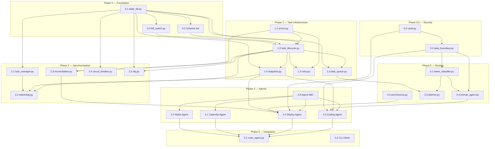

# MAX OS v1 — Dependency Order & Controlled Execution Schedule

### The exact order things get built, what blocks what, and why.
### This is the document you hand to the build agent at the start of
### every session.

---

## 1. Dependency Graph (Full System)



---

## 2. Critical Path

The longest dependency chain determines the minimum build time. Here it is:

```
state_db → schema → kill_switch → task_lifecycle → task_queue → planner
  │                                      │              │
  │                                      ▼              │
  │                                 snapshot ────────────┤
  │                                      │              │
  │                                      ▼              │
  └─► vault → data_boundary → prompt_agent → Coding Agent → main_agent
                                                  │
                                                  ▼
                                           Deploy Agent ──┘
```

**The critical path runs through the Coding Agent.** It has the most
dependencies (snapshot, prompt_agent, data_boundary) and the most
complex acceptance criteria. Plan to spend the most time here.

---

## 3. Build Sprints (Controlled Execution Schedule)

### Sprint 0: Bootstrap (Day 1-2)
**Goal:** The floor exists. Nothing else until this is done.

| Order | Module | Est. Hours | Gate |
|-------|--------|-----------|------|
| 1 | `src/infra/state_db.py` | 1 | WAL mode verified |
| 2 | `max_state_schema.sql` applied | 1 | 11 tables exist |
| 3 | Seed `phases`/`steps` tables | 1 | All steps from ARCHITECTURE.md seeded |
| 4 | `src/core/kill_switch.py` | 3 | Dummy task killed in <1s |
| 5 | `src/infra/vault.py` | 3 | Secret stored/retrieved, no plaintext in repo |
| 6 | `src/core/data_boundary.py` | 2 | Fake API key stripped from outbound payload |

**Sprint 0 exit criteria:** Kill switch armed, secrets secure, data
boundary enforced. 6 modules, ~11 hours.

---

### Sprint 1: Task Engine (Day 3-5)
**Goal:** Tasks can be created, queued, executed, and survive a crash.

| Order | Module | Est. Hours | Gate |
|-------|--------|-----------|------|
| 7 | `src/infra/errors.py` | 1 | 5 error classes, correct classification |
| 8 | `src/infra/task_lifecycle.py` | 4 | All state transitions enforced, illegals raise |
| 9 | `src/infra/task_queue.py` | 3 | Priority dequeue, aging, backpressure |
| 10 | `src/infra/snapshot.py` | 4 | Partial-write rollback verified |
| 11 | `src/infra/retry.py` | 2 | Jittered backoff, per-class policy |

**Sprint 1 exit criteria:** A mock task goes CREATED → QUEUED → RUNNING
→ DONE, and a forced failure correctly rolls back and retries. 5 modules,
~14 hours.

---

### Sprint 2: Synchronization (Day 6-8)
**Goal:** Multiple tasks can run without stepping on each other.

| Order | Module | Est. Hours | Gate |
|-------|--------|-----------|------|
| 12 | `src/infra/lock_manager.py` | 4 | Deadlock test passes (timeout-bounded) |
| 13 | `src/infra/watchdog.py` | 3 | Hung agent killed at 45s, rolled back |
| 14 | `src/infra/reconciliation.py` | 3 | Lying agent caught, treated as SYSTEMIC |
| 15 | `src/infra/circuit_breaker.py` | 2 | 6th failure rejected, other agents fine |
| 16 | `src/infra/dlq.py` | 2 | Dead task visible, requeueable |

**Sprint 2 exit criteria:** Two concurrent tasks with shared resources
don't deadlock. A crashed agent gets cleaned up automatically. 5 modules,
~14 hours.

---

### Sprint 3: Routing (Day 9-10)
**Goal:** User input reaches the right agent with the right permissions.

| Order | Module | Est. Hours | Gate |
|-------|--------|-----------|------|
| 17 | `src/core/intent_classifier.py` | 4 | 10 messages classified, <70% asks to clarify |
| 18 | `src/infra/permissions.py` | 2 | 5 bypass attempts all fail |
| 19 | `src/core/planner.py` | 4 | Compound "build, deploy, remind" → 3 ordered tasks |
| 20 | `src/core/prompt_agent.py` | 3 | No credential patterns in output |

**Sprint 3 exit criteria:** A natural-language request is correctly
classified, tier-assigned, decomposed if compound, and prompt-built
with secrets stripped. 4 modules, ~13 hours.

---

### Sprint 4: Agents (Day 11-16)
**Goal:** All four v1 agents work end-to-end.

| Order | Module | Est. Hours | Gate |
|-------|--------|-----------|------|
| 21 | Agent base interface (ABC) | 2 | Contract enforced |
| 22 | `src/agents/calendar_agent.py` | 4 | Event created, conflict detected |
| 23 | `src/agents/notes_agent.py` | 5 | Note stored, semantic search works |
| 24 | `src/agents/coding_agent.py` | 8 | Code produced, rollback on forced failure |
| 25 | `src/agents/deploy_agent.py` | 10 | Gate unbypassable, idempotent redeploy |

**Sprint 4 exit criteria:** Each agent handles its domain correctly.
Deploy Agent's production gate is verified unbypassable. 5 modules,
~29 hours.

---

### Sprint 5: Integration (Day 17-20)
**Goal:** Everything works together as a daemon + CLI.

| Order | Module | Est. Hours | Gate |
|-------|--------|-----------|------|
| 26 | `src/core/main_agent.py` | 6 | Full pipeline: input → classify → plan → execute |
| 27 | `src/cli/max_trace.py` | 3 | `max trace --last 20` shows real data |
| 28 | `src/cli/dlq.py` | 1 | `max dlq --list` shows dead tasks |
| 29 | CLI client | 3 | Sends requests, renders responses |
| 30 | Startup recovery | 4 | Crash mid-task → restart → no stuck state |
| 31 | systemd / NSSM service | 2 | Daemon survives reboot |

**Sprint 5 exit criteria:** End-to-end test: user types a request, it
completes, is logged, and is visible in the trace CLI. 6 deliverables,
~19 hours.

---

### Sprint 6: Verification & Hardening (Day 21-28)
**Goal:** Prove it's actually reliable, not just coded.

| Order | Test | Est. Hours | Gate |
|-------|------|-----------|------|
| 32 | Phase 1 E2E: single agent flow | 3 | Full loop, no mocks |
| 33 | Phase 2 concurrency: 3 agents, disjoint resources | 4 | Timestamps overlap correctly |
| 34 | Phase 2 deadlock: 2 tasks, reverse-order locks | 2 | Completes without hanging |
| 35 | Phase 3 gate bypass: 10+ phrasings | 3 | All blocked |
| 36 | Phase 3 deploy idempotency: same SHA twice | 2 | Deploy count = 1 |
| 37 | Phase 4 kill switch under load | 3 | 3+ tasks killed <1s |
| 38 | Phase 4 chaos: 50× random crash-and-recover | 8 | Zero stuck states |
| 39 | Full repo secret scan (gitleaks) | 1 | Zero findings |
| 40 | Outcome tracker accuracy | 2 | Stats match actual results |

**Sprint 6 exit criteria:** All tests pass. Pre-v1 risk gate checklist
(from 04_RISK_AREAS.md) is 100% complete. ~28 hours.

---

## 4. Parallel Build Opportunities

Not everything is strictly sequential. These can be built in parallel
by different sessions/agents:

```
PARALLELIZABLE:
     │
     ├── Group A (infrastructure):      Group B (security):
     │   errors.py                      vault.py
     │   task_lifecycle.py              data_boundary.py
     │   task_queue.py
     │
     ├── Group C (sync):                Group D (routing):
     │   lock_manager.py                intent_classifier.py
     │   circuit_breaker.py             permissions.py
     │                                  (once data_boundary exists)
     │
     └── Group E (agents — SEQUENTIAL, not parallel):
         Calendar → Notes → Coding → Deploy
         (each builds on lessons from the previous)

NOT PARALLELIZABLE (strict order required):
     state_db → schema → kill_switch (must be first 3)
     snapshot → agents (agents depend on snapshot)
     planner → main_agent (planner must exist first)
```

---

## 5. Session Handoff Protocol

Every coding session (whether human or AI agent) must:

### Start of Session
```sql
-- 1. Where am I?
SELECT * FROM steps WHERE status != 'done' ORDER BY step_id LIMIT 1;

-- 2. What happened last?
SELECT summary FROM sessions ORDER BY started_at DESC LIMIT 1;

-- 3. Any blockers?
SELECT * FROM blockers WHERE resolved = 0;

-- 4. Log this session
INSERT INTO sessions (session_id, started_at)
VALUES (uuid4(), datetime('now'));
```

### End of Session
```sql
-- 1. Update step status
UPDATE steps SET status = 'done', -- or 'in_progress' or 'blocked'
  notes = 'exactly what is left to do',
  last_updated = datetime('now')
WHERE step_id = ?;

-- 2. Close session
UPDATE sessions SET
  ended_at = datetime('now'),
  ended_reason = ?,  -- 'completed_step' / 'quota_exhausted' / 'user_stopped'
  steps_touched = ?,
  summary = ?  -- plain-English state of the world
WHERE session_id = ?;

-- 3. Log any decisions made
INSERT INTO decisions_log (session_id, step_id, timestamp, decision, reasoning)
VALUES (?, ?, datetime('now'), ?, ?);
```

---

## 6. Total Effort Estimate

| Sprint | Modules | Hours | Calendar Days |
|--------|---------|-------|---------------|
| 0: Bootstrap | 6 | 11 | 2 |
| 1: Task Engine | 5 | 14 | 3 |
| 2: Synchronization | 5 | 14 | 3 |
| 3: Routing | 4 | 13 | 2 |
| 4: Agents | 5 | 29 | 6 |
| 5: Integration | 6 | 19 | 4 |
| 6: Verification | 9 tests | 28 | 8 |
| **TOTAL** | **31 deliverables** | **~128 hours** | **~28 days** |

**Buffer:** Add 30% for unknowns → **~37 calendar days** to v1 daily use.

---

## 7. Scope Discipline Checkpoints

| After Sprint | Checkpoint |
|-------------|------------|
| Sprint 0 | ✋ STOP — verify kill switch works under all conditions |
| Sprint 2 | ✋ STOP — verify no deadlock scenarios exist |
| Sprint 4 | ✋ STOP — verify production gate is unbypassable |
| Sprint 5 | ✋ STOP — full end-to-end test, no mocks |
| Sprint 6 | ✋ STOP — all risk gates pass → v1 is ready for daily use |

**After Sprint 6, and ONLY after 2 weeks of real daily use (ARCHITECTURE.md
step 4.5), may agent #5 (Web Search) get a single line of code.**
